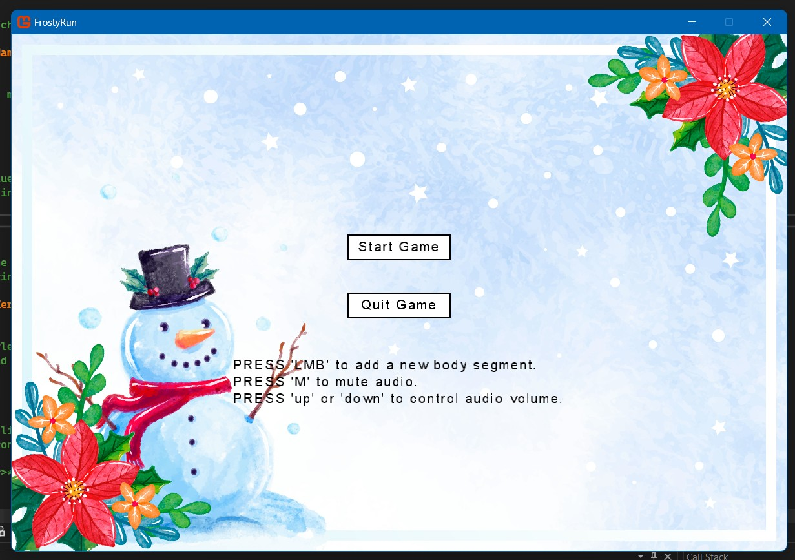
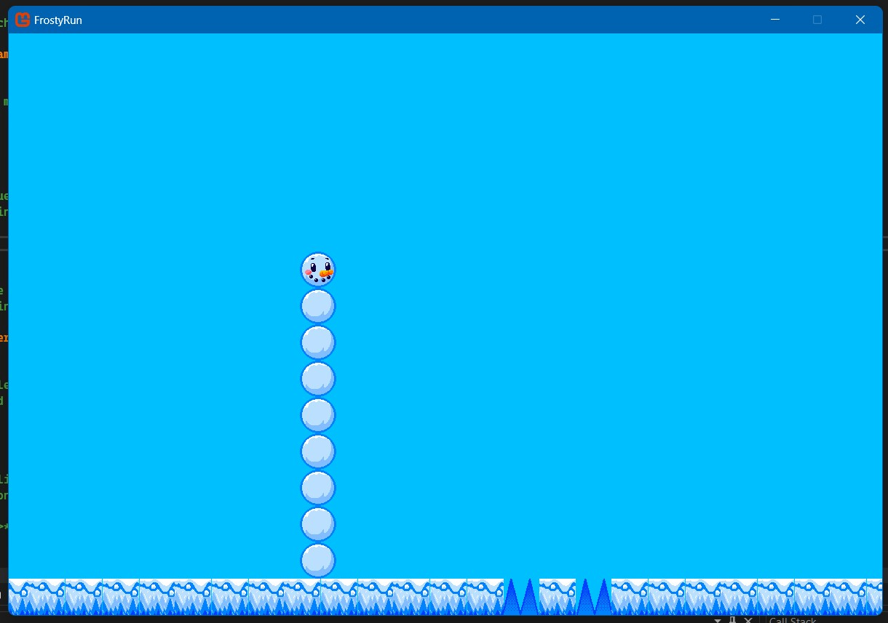

# FrostyRun

**Disclaimer:** This project is a Work in Progress (WIP). 

## Overview
FrostyRun is a simple and fun game where players control a snowman that runs and dodges obstacles. The player can click to add body segments to the snowman, which dynamically follow the main body as they navigate through icy platforms and avoid spikes. 

## Development Details
FrostyRun is developed in **C#** using the **MonoGame framework**. MonoGame provides a flexible and powerful environment for creating 2D games, making it perfect for this project. The game features mechanics that showcase object tracking and collision handling, among other game development principles. 

## WIP Screenshots
Here are a few early previews of FrostyRun's development:

### Start Screen
  
*A look at the initial start screen of the game.*

### Gameplay Screen
  
*A rough preview of the gameplay screen in its current state.*

